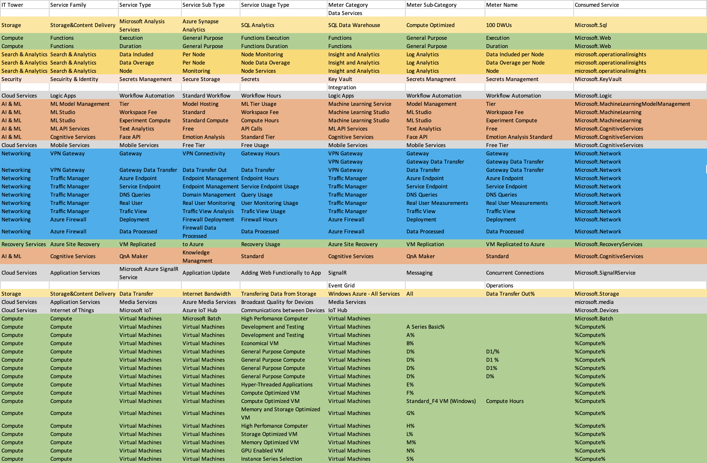
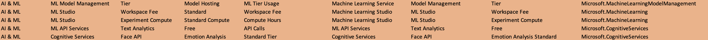
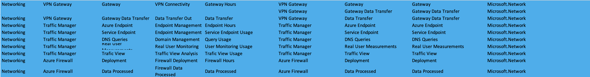

# Лабораторная работа 2. Сравнение сервисов Amazon Web Services и Microsoft Azure. Создание единой кросс-провайдерной сервисной модели.

## 3 вариант

## Цель работы: 
Получение навыков аналитики и понимания спектра публичных облачных сервисов без привязки к вендору. Формирование у студентов комплексного видения Облака. 

## Дано: 
Данные лабораторной работы 1.
Слепок данных биллинга от провайдера после небольшой обработки в виде SQL-параметров. Символ % в начале/конце означает, что перед/после него может стоять любой набор символов.
Образец итогового соответствия, что желательно получить в конце. В этом же документе  

## Необходимо: 
Импортировать файл .csv в Excel или любую другую программу работы с таблицами. Для Excel делается на вкладке Данные – Из текстового / csv файла – выбрать файл, разделитель – точка с запятой.
Распределить потребление сервисов по иерархии, чтобы можно было провести анализ от большего к меньшему (напр. От всех вычислительных ресурсов Compute дойти до конкретного типа использования - Выделенной стойка в датацентре Dedicated host usage). При этом сохранять логическую концепцию, выработанную в Лабораторной работе 1.
Сохранить файл и залить в соответствующую папку на Google Drive.

## Ход работы:
1. Дан следующий слепок биллинга:

2. Заполним 5 столбцов таблицы:

## Опишем сервисы, которые мы использовали:

# Storage: Storage & Content Delivery

## Microsoft Analysis Services
- **Описание**:  
  Предоставляет инструменты для выполнения аналитических вычислений и обработки данных.
  
- **Детали использования**:  
  - **Service Sub-Type**: Azure Synapse Analytics - SQL Analytics, SQL Data Warehouse.  
  - **Meter Name**: Compute Optimized - использование вычислительных ресурсов.  
  - **Consumed Service**: Microsoft.Sql  

# Compute: Azure Functions

## Functions Execution
- **Описание**:  
  Исполняемые функции общего назначения для выполнения операций в облаке.  
  
- **Детали использования**:  
  - **Service Sub-Type**: General Purpose - использование функций общего назначения.  
  - **Meter Name**: Functions Execution - выполнение функций.  
  - **Consumed Service**: Microsoft.Web  

## Functions Duration
- **Описание**:  
  Измерение времени выполнения функций в облаке.  
  
- **Детали использования**:  
  - **Service Sub-Type**: General Purpose - измерение времени выполнения функций.  
  - **Meter Name**: Functions Duration - длительность выполнения.  
  - **Consumed Service**: Microsoft.Web  

# Search & Analytics: Insight and Analytics

## Log Analytics: Data Included per Node
- **Описание**:  
  Анализ данных, поступающих с узлов (Nodes).  
  
- **Детали использования**:  
  - **Service Sub-Type**: Per Node - данные включены для каждого узла.  
  - **Meter Name**: Data Included - включенный объем данных.  
  - **Consumed Service**: microsoft.operationalinsights  

## Log Analytics: Data Overage per Node
- **Описание**:  
  Учет данных, превышающих установленный лимит.  
  
- **Детали использования**:  
  - **Service Sub-Type**: Per Node - превышение лимитов данных для узлов.  
  - **Meter Name**: Data Overage - избыточные данные.  
  - **Consumed Service**: microsoft.operationalinsights  

## Log Analytics: Node Monitoring
- **Описание**:  
  Мониторинг состояния узлов.  
  
- **Детали использования**:  
  - **Service Sub-Type**: Node Services - услуги мониторинга узлов.  
  - **Meter Name**: Node Monitoring - мониторинг узлов.  
  - **Consumed Service**: microsoft.operationalinsights  

# Security & Identity: Azure Key Vault

## Secrets Management
- **Описание**:  
  Обеспечивает безопасное хранение секретов, таких как ключи шифрования и пароли.  
  
- **Детали использования**:  
  - **Service Sub-Type**: Secure Storage - безопасное хранилище секретов.  
  - **Meter Name**: Secrets Management - управление секретами.  
  - **Consumed Service**: Microsoft.KeyVault  

# Cloud Services: Logic Apps

## Workflow Automation
- **Описание**:  
  Автоматизация рабочих процессов с использованием Azure Logic Apps.  
  
- **Детали использования**:  
  - **Service Sub-Type**: Standard Workflow - стандартный рабочий процесс.  
  - **Meter Name**: Workflow Hours - часы рабочего процесса.  
  - **Consumed Service**: Microsoft.Logic  

# AI & ML

## ML Model Management
- **Описание**:  
  Управление развертыванием и обслуживанием моделей машинного обучения.  
  
- **Детали использования**:  
  - **Service Sub-Type**: Tier - тарифный план.  
  - **Meter Name**: ML Tier Usage - использование уровня тарифа.  
  - **Consumed Service**: Microsoft.MachineLearningModelManagement  

## ML Studio
- **Workspace Fee**:  
  - **Описание**: Стандартная плата за использование ML Studio.  
  - **Meter Name**: Workspace Fee - фиксированная плата.  
  - **Consumed Service**: Microsoft.MachineLearning  

- **Experiment Compute**:  
  - **Описание**: Использование вычислительных ресурсов для экспериментов.  
  - **Meter Name**: Compute Hours - вычислительные часы.  
  - **Consumed Service**: Microsoft.MachineLearning  

## ML API Services
- **Описание**:  
  Инструменты API для анализа текста и других задач машинного обучения.  
  
- **Детали использования**:  
  - **Service Sub-Type**: Text Analytics - API для текстового анализа.  
  - **Meter Name**: Free API Calls - бесплатные вызовы API.  
  - **Consumed Service**: Microsoft.CognitiveServices  

# Networking

## VPN Gateway
- **Gateway**:  
  - **Описание**: Подключение через VPN.  
  - **Meter Name**: Gateway Hours - часы работы VPN.  
  - **Consumed Service**: Microsoft.Network  

- **Data Transfer**:  
  - **Описание**: Передача данных через шлюз.  
  - **Meter Name**: Data Transfer Out - объем данных.  
  - **Consumed Service**: Microsoft.Network  

## Traffic Manager
- **Azure Endpoint**:  
  - **Описание**: Управление конечными точками.  
  - **Meter Name**: Endpoint Hours - часы конечных точек.  
  - **Consumed Service**: Microsoft.Network  

- **DNS Queries**:  
  - **Описание**: Управление запросами DNS.  
  - **Meter Name**: Query Usage - количество запросов.  
  - **Consumed Service**: Microsoft.Network  

# Recovery Services: Azure Site Recovery

## VM Replicated to Azure
- **Описание**:  
  Репликация виртуальных машин в облако Azure для аварийного восстановления.  
  
- **Детали использования**:  
  - **Service Sub-Type**: VM Replication - репликация виртуальных машин.  
  - **Meter Name**: Recovery Usage - объем использования.  
  - **Consumed Service**: Microsoft.RecoveryServices  
