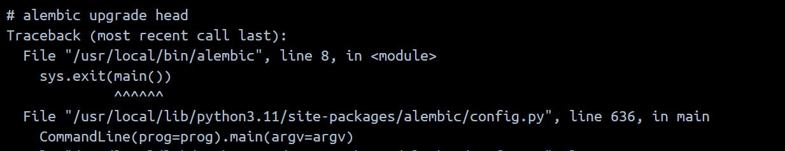
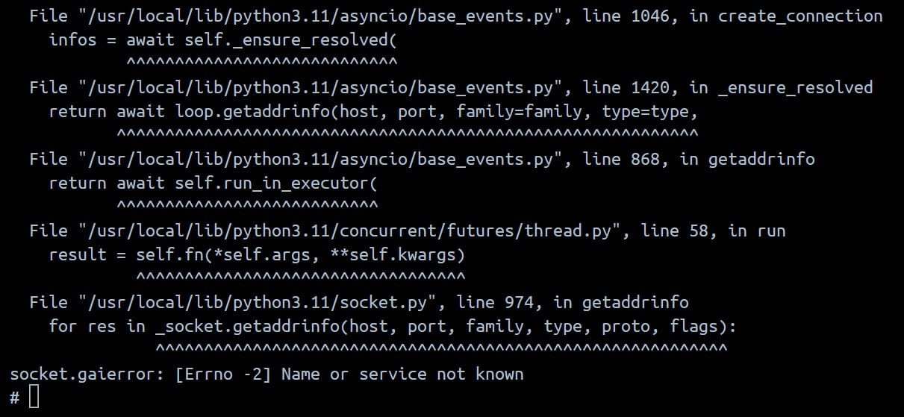
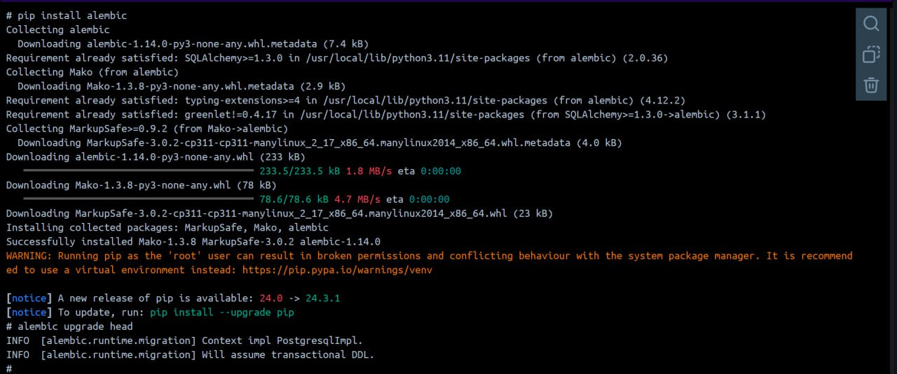
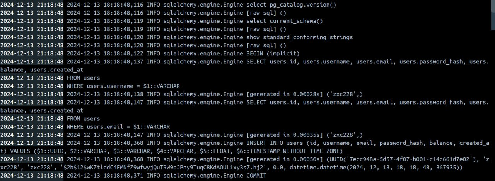

# Лабораторная работа по предмету "Облачные технологии и услуги"

## Техническое задание

1. **Написать “плохой” Docker compose файл, в котором есть не менее трех “bad practices” по их написанию**

2. **Написать “хороший” Docker compose файл, в котором эти плохие практики исправлены**

3. **В Readme описать каждую из плохих практик в плохом файле, почему она плохая и как в хорошем она была исправлена, как исправление повлияло на результат**

4. **После предыдущих пунктов в хорошем файле настроить сервисы так, чтобы контейнеры в рамках этого compose-проекта так же поднимались вместе, но не "видели" друг друга по сети. В отчете описать, как этого добились и кратко объяснить принцип такой изоляции**

# Начало работы

## 1. Напишем “плохой” docker-compose файл, используя несколько “bad practices”

```yml
version: "3.8"

services:
  server:
    build: server/
    command: python ./server.py
    ports:
      - 3000:3000
    healthcheck:
      test: [ "CMD", "curl", "-f", "http://localhost:3000" ]
      interval: 10s
      retries: 5
    networks:
      - default_net

  client:
    build: client/
    command: python ./client.py
    depends_on:
      server:
        condition: service_healthy
    network_mode: host 
    environment:
      - DEBUG=True 

networks:
  default_net:
    driver: bridge 
```

## Docker-compose Bad Practices

### 1. Использование network_mode: host для клиента:
* **Почему это плохо:** 

    * Применение ```network_mode: host``` позволяет контейнеру клиента использовать сеть хоста напрямую, что может привести к конфликтам портов и снижению уровня безопасности, так как контейнер получает доступ ко всем сетевым интерфейсам хоста.

### 2. Неявная конфигурация сети:
* **Почему это плохо:** 
    
    * Указание ```driver: bridge``` для сети ```default_net``` является недостаточно детальным. Не указаны параметры конфигурации, которые могут улучшить управление сетью и обеспечить лучшую изоляцию или производительность.

### 3. Передача конфиденциальных данных через переменные окружения:
* **Почему это плохо:** 

    * Установка переменной окружения ```DEBUG=True``` может привести к раскрытию конфиденциальной информации о приложении. Это может быть использовано злоумышленниками для атаки на приложение, если отладочная информация будет доступна.

### 4. Не указаны версии образов:
* **Почему это плохо:** 

    * В директиве ```build``` не указана конкретная версия базового образа. Это может привести к непредсказуемым изменениям в поведении приложения, если базовый образ будет обновлен и изменит API или поведение.


## 2. Напишем “хороший” docker-compose файл, используя несколько “good practices”

```yml
version: "3.8"

services:
  server:
    build:
      context: server/
      dockerfile: Dockerfile
    command: python ./server.py
    ports:
      - "3000:3000"
    healthcheck:
      test: [ "CMD", "curl", "-f", "http://localhost:3000" ]
      interval: 10s
      retries: 5
    networks:
      - default_net

  client:
    build:
      context: client/
      dockerfile: Dockerfile
    command: python ./client.py
    depends_on:
      server:
        condition: service_healthy
    networks:
      - default_net
    environment:
      - DEBUG=False

networks:
  default_net:
    driver: bridge

```

## Docker-compose Good Practices

### 1. Использование network_mode: host для клиента:
* **Исправление:** 

    *  Убрано ```network_mode: host``` и добавлено использование общей сети ```default_net```.

* **Влияние:** 

    * Это повышает уровень безопасности и предотвращает возможные конфликты портов, обеспечивая при этом возможность связи между контейнерами.

### 2. Неявная конфигурация сети:
* **Исправление:** 

    * Указан драйвер сети ```bridge```, но стоит рассмотреть возможность добавления параметров для конфигурации (например, настройки IP-адресов).

* **Влияние:** 

    * Явное указание драйвера улучшает читаемость и предсказуемость конфигурации сети, хотя для более сложных сетевых сценариев могут потребоваться дополнительные параметры.

### 3. Передача конфиденциальных данных через переменные окружения:
* **Исправление:** 

    * Переменная окружения ```DEBUG=True``` заменена на ```DEBUG=False```

* **Влияние:** 

    * Это уменьшает риск утечек конфиденциальной информации и делает приложение более безопасным.

### 4. Не указаны версии образов:
* **Исправление:** 

    * Добавьте в Dockerfile указание конкретной версии базового образа

* **Влияние:** 

    * Указание конкретной версии образа предотвращает неожиданные изменения в поведении приложения из-за обновлений базового образа, что делает его более стабильным и предсказуемым.

## 3. В хорошем файле настроим сервисы так, чтобы контейнеры в рамках этого проекта поднимались вместе, но не "видели" друг друга по сети.

```yml
version: "3.8"

services:
  server:
    networks:
      - server_net

  client:
    networks:
      - client_net

networks:
  server_net:
    driver: bridge
  client_net:
    driver: bridge

```

## Изоляция

В представленном Docker Compose файле реализована изоляция сервисов через использование отдельных сетей для каждого сервиса

* **Как реализовали:**
    
    * **Отдельные сети для каждого сервиса:**
    Сервисы ```server``` и ```client``` подключены к разным сетям: ```server_net``` и ```client_net```, соответственно. Это означает, что контейнеры, запущенные в этих сервисах, не смогут напрямую взаимодействовать друг с другом, так как они находятся в разных сетях.

    * **Использование драйвера bridge:**
    Для обеих сетей указан драйвер ```bridge```, который создает виртуальные сети с изолированными пространствами имен. Драйвер ```bridge``` позволяет контейнерам внутри одной сети взаимодействовать между собой, но ограничивает взаимодействие с контейнерами в других сетях, что улучшает безопасность и управляемость.

* **Преимущества изоляции:**

    * **Безопасность:** Изоляция сервисов предотвращает несанкционированный доступ и взаимодействие между контейнерами, что помогает минимизировать риски безопасности.

    * **Управляемость:** С помощью отдельных сетей можно лучше контролировать, какие сервисы могут общаться друг с другом, что упрощает администрирование и конфигурацию сети.

    * **Гибкость:** Легко можно изменять конфигурацию сетей или добавлять новые сервисы без влияния на существующие.

## Пример изоляции

Рассмотрим изоляцию контейнеров на примере рабочего проекта.

### Docker-compose файл проекта
```yml
services:
  db:
    image: postgres:14-alpine
    container_name: db
    hostname: db
    restart: always
    ports:
      - "5433:5432"
    environment:
      POSTGRES_PASSWORD: ${DB_PASS}
      POSTGRES_USER: ${DB_USER}
      POSTGRES_DB: ${DB_NAME}
    networks:
      - no-service-web
    volumes:
      - db:/var/lib/postgresql/data

  backend: 
    container_name: backend_hr
    hostname: backend_hr
    restart: always
    build:
      context: "./backend"
    environment:
      DB_HOST: ${DB_HOST}
      DB_PORT: ${DB_PORT}
      DB_NAME: ${DB_NAME}
      DB_USER: ${DB_USER}
      DB_PASS: ${DB_PASS}
      OPENAI_API_KEY: ${OPENAI_API_KEY}
      PROXY_USERNAME: ${PROXY_USERNAME}
      PROXY_PASS: ${PROXY_PASS}
      PROXY_ENDPOINT: ${PROXY_ENDPOINT}
    ports:
      - "8000:8000"
    networks:
      - service-web
    depends_on:
      - db

networks:
  service-web:
    driver: bridge
  no-service-web: 
    driver: bridge

volumes:
  db: {}
```

Пытаемся накатить миграции, но у нас не получается, т.к. контейнеры "db" и "backend" находятся в разных сетях




Теперь настроим наш docker-compose файл так, чтобы контейнеры были в одной сети.

```yml
services:
  db:
    image: postgres:14-alpine
    container_name: db
    hostname: db
    restart: always
    ports:
      - "5433:5432"
    environment:
      POSTGRES_PASSWORD: ${DB_PASS}
      POSTGRES_USER: ${DB_USER}
      POSTGRES_DB: ${DB_NAME}
    networks:
      - service-web
    volumes:
      - db:/var/lib/postgresql/data

  backend: 
    container_name: backend_hr
    hostname: backend_hr
    restart: always
    build:
      context: "./backend"
    environment:
      DB_HOST: ${DB_HOST}
      DB_PORT: ${DB_PORT}
      DB_NAME: ${DB_NAME}
      DB_USER: ${DB_USER}
      DB_PASS: ${DB_PASS}
      OPENAI_API_KEY: ${OPENAI_API_KEY}
      PROXY_USERNAME: ${PROXY_USERNAME}
      PROXY_PASS: ${PROXY_PASS}
      PROXY_ENDPOINT: ${PROXY_ENDPOINT}
    ports:
      - "8000:8000"
    networks:
      - service-web
    depends_on:
      - db

networks:
  service-web:
    driver: bridge
    
volumes:
  db: {}
```

Здесь пытаемся накатить миграции и всё успешно, т.к. контейнеры теперь находятся в одной сети.



Также кинем запрос на эндпоинт создания user и увидим, что user успешно создан - значит у теперь контейнеры видят друг-друга.

