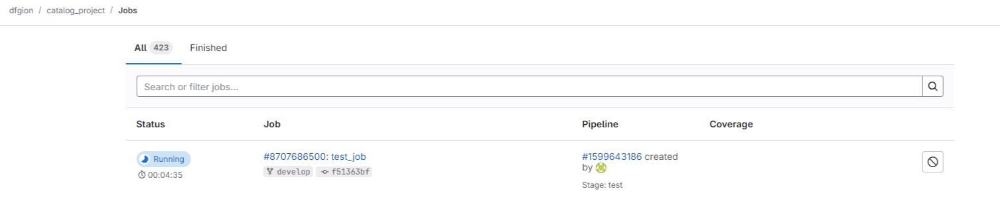
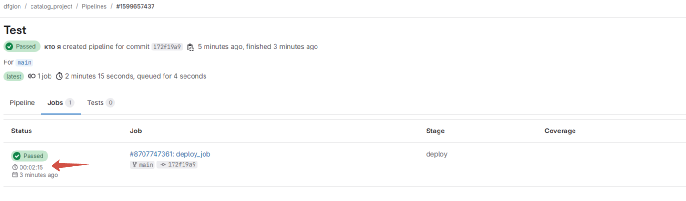
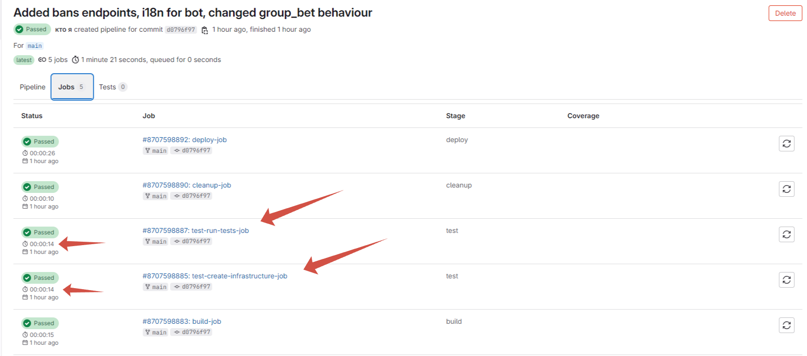
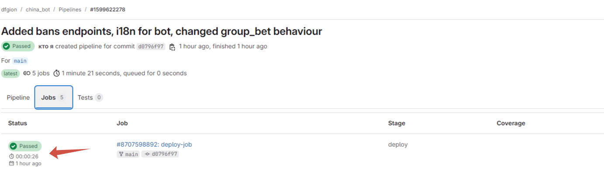

# Отчет для лабы 3
Среда выполнения работы **GITLAB**
## Краткое описание Плохого подхода
В плохом подходе средой выполнения пайплайна выбран локальный gitlab-runner, который использует docker, а сам запускается как сервис, в процессе выполнения каждую джобу прогоняет в отдельному контейнере

### Ужасный пайплайн
```yml
stages:
  - test
  - merge
  - deploy

services:
  - docker:24.0.5-dind

variables:
  DOCKER_HOST: tcp://docker:2375
  DOCKER_TLS_CERTDIR: ""

before_script:
  - docker info
  - apk update
  - apk add --no-cache openssh-client
  - mkdir -p ~/.ssh
  - echo "$SSH_PRIVATE_KEY" > ~/.ssh/id_rsa
  - chmod 600 ~/.ssh/id_rsa
  - eval $(ssh-agent -s)
  - ssh-add ~/.ssh/id_rsa

test_job:   
  stage: test  
  script:
    - apk add --no-cache bash make cmake gcc python3-dev musl-dev linux-headers
    - apk add --update --no-cache python3
    - ln -sf python3 /usr/bin/python
    - python3 -m ensurepip
    - pip3 install --no-cache --upgrade pip setuptools
    - make test
    - echo "Test containers have been run"
    - sleep 5
    - docker logs test_migrations
    - pip install -r backend/requirements.txt
    - echo "Requirements have been installed"
    - pytest
    - echo "Tests complete"
  only:
    - develop

merge:
  stage: merge
  script:
    - apk add --no-cache git
    - ssh-keyscan gitlab.com >> ~/.ssh/known_hosts
    - git fetch origin 
    - git remote set-url origin git@gitlab.com:dfgion/catalog_project.git
    - git checkout main
    - git merge origin/develop
    - git push origin main
  only:
    - develop


deploy_job:
  stage: deploy
  script:
    - echo "Deploying to  production..."
    - ssh -o StrictHostKeyChecking=no root@147.45.110.26 "cd catalog_project && git pull origin main && make reload"
  only:
    - main
```

В данном пайплайне допущена куча различных плохих практик: 
1. Костыль в коннекте по ssh. На сервер, куда пайплайн прокидывает изменения есть проект (склонированный в gitlab), после выполнения тестов идёт подключение к серверу по ssh внутри локального контейнера, в который прокидываются ssh ключи, что является очень небезопасным решением
2. Использование сложного before_script, который прогоняется во всех джобах и тормозит их работу
3. Есть джоба, которая мерджит ветку main с веткой develop с опять же через использование ssh ключей (пуллит ветку, меджит, отправляет изменения)
4. В test_job устаналивается python, зависимости и запускаются тесты, вместо использования уже готового image docker для прогона тестов, что очень сильно тормозит работу всего pipeline
5. В deploy_job идёт подключение к серверу, вход в папку с проектом и git_pull, что является очень плохой практикой, так как это накладывает зависимость на пайплайн, чтобы проект лежал строго в определенной папке

### Прекрасный пайплайн
```yml
stages:
  - build
  - test
  - cleanup
  - deploy

before_script:
  - apk add make cmake

build-job:
  stage: build
  script:
    - make build

test-create-infrastructure-job:
  stage: test
  script:
    - make up-test-containers

test-run-tests-job:
  needs: ["test-create-infrastructure-job"]
  stage: test
  script:
    - docker run -e TEST_MODE=yes --network china_bot_test --rm backend pytest -s -v

cleanup-job:
  stage: cleanup
  script:
    - make stop-test-containers
  when: always

deploy-job:
  stage: deploy
  script:
    - make reload
```

### Makefile для хорошего пайплайна
```Makefile
all: up-test-containers build stop-test-containers reload

up-test-containers:
	docker compose --profile test up --build -d
	sleep 5
	docker restart test_migrations

build:
	docker build -t backend ./backend
	docker build -t bot ./bot
	docker build -t tpg ./tron-payment-gateway
	docker build -t migrations ./migrations
	docker build -t gateway ./gateway

stop-test-containers:
	docker compose --profile test down
	 
reload:
	docker compose --profile production up --no-recreate -d production_redis production_postgres
	sleep 10
	docker compose --profile production up --build -d production_migrations backend gateway tron_payment_gateway bot 
	docker restart gateway
```

В данном пайплайне gitlab-runner крутится на самом сервере с прокинутым docker.sock для работы в docker сервисом, который находится на сервере, все обновления автоматически подтягиваются через перезапуск контейнеров, так как gitlab-runner находится прямо на сервере

Исправление плохих практик:
1. Полностью убрано подключение через ssh и прокидывание ключей для коннекта путём размещения runner прямо на сервере
2. В before_sctipt используется очень быстрая установка зависимости необходимая pipeline
3. Убрана джоба с мерджем веток, так как в проде на main обычно происходит мердж через интерфейс gitlab, после ревью от старшего разработчика, а не автоматически после тестов
4. В тесты разделены на 2 джобы: test-create-infrastructure-job (поднятие контейнеров для теста), test-run-tests-job(сам прогон тестов), для запуска тестов теперь не требуется столько времени, как это было в плохом пайплайне, так как используется уже собранный image докер, который хранит в себе python и все зависимости (Это приложение бекенда), вместо CMD директивы в docker используется команда pytest через docker run, чтобы прогнать тесты внутри контейнера с backend, после чего прекратить его работу, вынеся в логи все тесты
5. В данном варианте нет git pull, а для deploy просто используется перезапуск контейнеров с апдейтами

## Скрины работы:

# Плохой пайплайн 


Как можно увидеть только тесты идут 4 минуты


Деплой прогоняется на ветке main (Поэтому одна джоба показана, другие в ветке deploy) 2:15 минуты

# Хороший пайплайн 


Тесты выполняются за 28 секунд (создание инфры 14 и сам тест 14)


Деплой прогоняется быстро за 26 секунд (Время прогона в данном случае = времени поднятия контейнеров, которые включают в себя healthcheck)
